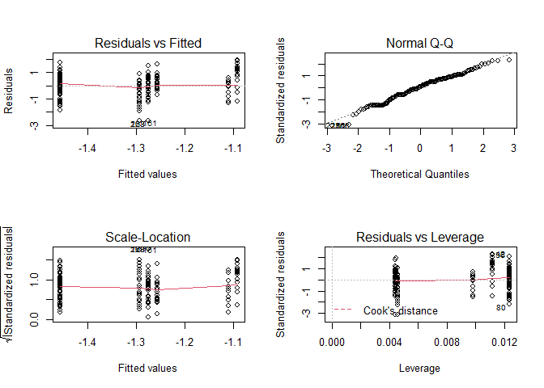
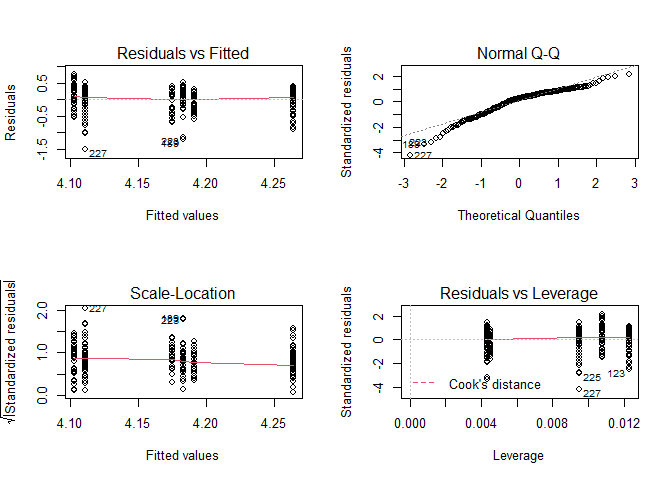
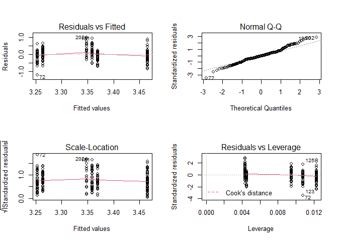
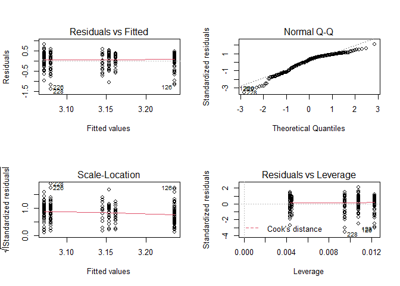
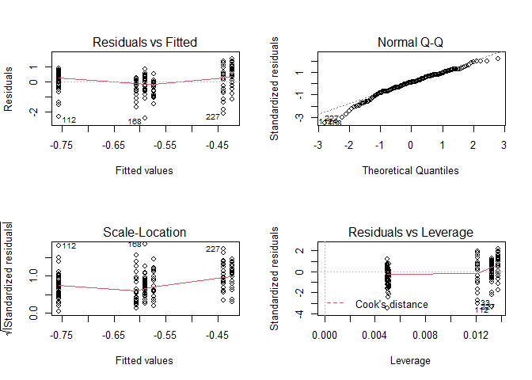
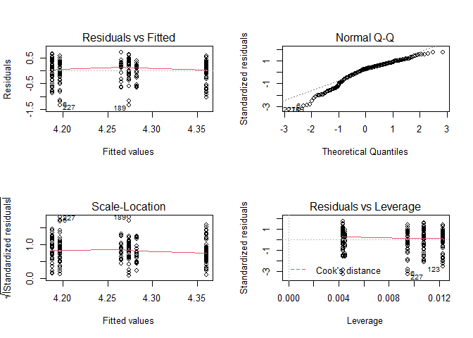
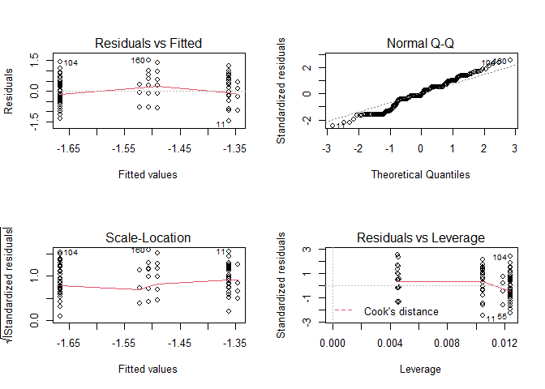
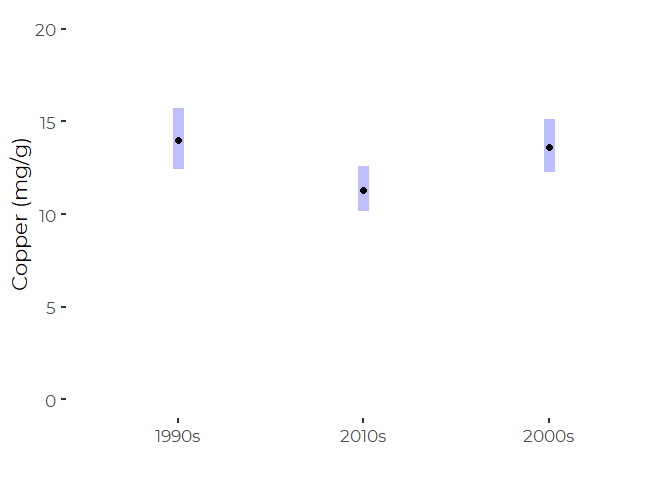

Trend Analysis for Selected Sums and Totals of Contaminants
================
Curtis C. Bohlen, Casco Bay Estuary Partnership
October 17, 2020

  - [Introduction](#introduction)
  - [Load Libraries](#load-libraries)
  - [Load Data](#load-data)
      - [Folder References](#folder-references)
      - [Metals Data](#metals-data)
          - [Units](#units)
          - [Change Factor Levels](#change-factor-levels)
  - [Select which Metals to Analyze](#select-which-metals-to-analyze)
      - [Remove metals data on metals we will not
        analyze](#remove-metals-data-on-metals-we-will-not-analyze)
  - [Simple Linear Regression
    Analysis](#simple-linear-regression-analysis)
      - [Utility function](#utility-function)
      - [Identify nominally significant
        Regressions](#identify-nominally-significant-regressions)
      - [Significant Slope Estimates](#significant-slope-estimates)
  - [ANOVA (Ordered Factor) Analysis](#anova-ordered-factor-analysis)
      - [Preliminary Model](#preliminary-model)
      - [Stepwise Model Selection](#stepwise-model-selection)
      - [Identification of models that included
        Era](#identification-of-models-that-included-era)
          - [What’s up with Copper?](#whats-up-with-copper)
  - [Generating a Summary Table](#generating-a-summary-table)


# Introduction

Casco Bay Estuary Partnership collected sediment samples in 1991, 1994,
2000, 2001, 2002, 2010, and 2011 to look at concentrations of toxic
contaminants in Casco Bay surface Sediments. These studies were
complemented by data collected by under the auspices of EPA’s the
National Coastal Assessment (NCA) and National Coastal Condition
Assessment (NCCA).

Chemicals studied included metals, polycyclic aromatic hydrocarbons
(PAHs), polychlorinated biphenyls (PCBs), organochlorine pesticides,
dioxins and furans, and organotins. These contaminants are all
persistent in the marine environment.

# Load Libraries

``` r
library(tidyverse)
```

    ## -- Attaching packages --------------------------------------- tidyverse 1.3.0 --

    ## v ggplot2 3.3.2     v purrr   0.3.4
    ## v tibble  3.0.3     v dplyr   1.0.2
    ## v tidyr   1.1.2     v stringr 1.4.0
    ## v readr   1.3.1     v forcats 0.5.0

    ## -- Conflicts ------------------------------------------ tidyverse_conflicts() --
    ## x dplyr::filter() masks stats::filter()
    ## x dplyr::lag()    masks stats::lag()

``` r
library(readxl)
library(knitr)

library(emmeans)

library(CBEPgraphics)
load_cbep_fonts()
theme_set(theme_cbep())

library(LCensMeans)
```

# Load Data

## Folder References

``` r
sibfldnm <- 'Derived_Data'
parent   <- dirname(getwd())
sibling  <- file.path(parent,sibfldnm)
niecefldnm <- 'Data_Subsets'
niece <- file.path(sibling,niecefldnm)
fn <- "metals.csv"
```

## Metals Data

``` r
metals_data <- read_csv(file.path(niece,fn),
                      col_types = cols(.default = col_character(),
                                        Sample_Year = col_double(),
                                        Replicate = col_integer(),
                                        CASRN = col_skip(),
                                        Result = col_double(),
                                        MDL = col_skip(),
                                        RL = col_skip(),
                                        Det_Flag = col_skip(),
                                        Qualifier = col_skip(),
                                        `QA Qualifier` = col_skip(),
                                        Reportable_Result = col_skip(),
                                        ERL = col_double(),
                                        ERM = col_double() )
                      ) %>%
  mutate(Replicate = Replicate == -1) %>%
  mutate(Parameter = if_else(Parameter == "Chromium (total)",
                             "Chromium",
                             Parameter))
```

### Units

See the “Review\_Data.Rmd” for details.

Ramboll Standardized units in the Access database, so, concentrations of
metals are expressed in \(\mu g/g\) dry weight (\~ ppm).

### Change Factor Levels

``` r
metals_data <- metals_data %>%
  mutate(LVL = factor(LVL, levels = c('Below ERL','Between ERL and ERM',
                                     'Above ERM'))) %>%
  mutate(Region = factor(Region, levels = c("Inner Bay",
                                            "West Bay",
                                            "East Bay",
                                            "Outer Bay",
                                            "Cape Small"))) %>%
  mutate(Era = ordered(Era, levels = c( "1990s", "2010s", "2000s")))
```

# Select which Metals to Analyze

``` r
(xt <- xtabs(~ Parameter + Era, data = metals_data))
```

    ##             Era
    ## Parameter    1990s 2010s 2000s
    ##   Aluminum       0    82    83
    ##   Antimony       0    82    83
    ##   Arsenic       65    82    83
    ##   Barium         0    75    38
    ##   Beryllium      0    75    38
    ##   Bismuth        0     0    38
    ##   Cadmium       65    82    83
    ##   Calcium        0     0    38
    ##   Chromium      65    82    83
    ##   Cobalt         0    75    38
    ##   Copper        65    82    83
    ##   Iron          65    82    83
    ##   Lead          65    82    83
    ##   Lithium        0     0    38
    ##   Magnesium      0     0    38
    ##   Manganese      0    82    83
    ##   Mercury       65    82    83
    ##   Molybdenum     0    75    38
    ##   Nickel        65    82    83
    ##   Potassium      0     0    38
    ##   Ruthenium      0     0    38
    ##   Selenium      65    82    83
    ##   Silver        65    82    83
    ##   Sodium         0     0    38
    ##   Strontium      0    75    38
    ##   Tellurium      0     0    38
    ##   Thallium       0    75    38
    ##   Tin            0    82    83
    ##   Titanium       0    75     0
    ##   Vanadium       0    75    38
    ##   Zinc          65    82    83

## Remove metals data on metals we will not analyze

We restrict analysis to those metals sampled in all three Eras.

``` r
rowcount <- apply(xt,1,function(x) sum(x>0))
selected <- names(rowcount[rowcount>2])

metals_data <- metals_data %>%
  filter(Parameter %in% selected)
rm(selected)
```

# Simple Linear Regression Analysis

On log-transformed data.

``` r
mods <-metals_data %>%
  filter(Parameter != 'Tellurium') %>%
  group_by(Parameter) %>%
  nest() %>%
  mutate(mod = lapply(data,
                      function(df) lm(log(Result) ~ Sample_Year, data = df)))
```

## Utility function

``` r
 mod_rev <- function(nm, m) {
 for (n in seq_along(m)) {
   cat("-------------------------------------\n")
   cat(nm[[n]], '\n')
   print(anova(m[[n]]))
   print(summary(m[[n]]))
   }
 }
```

## Identify nominally significant Regressions

From the log-linear models. We use P \< 0.025 because of relatively poor
model diagnostics. We don’t want to trust “borderline” P values, and we
don’t want to go to the trouble (for this purpose) of using boorstraps
or other methods to assess confidence limits more rigorously.

``` r
res <- lapply(mods$mod,function(m) summary(m)$coefficients[2,4])
names(res) <- mods$Parameter
```

So, statistically significant regressions include the following

``` r
sig_lms <- names(res[res<0.025])
sig_lms
```

    ## [1] "Cadmium"  "Chromium" "Lead"     "Nickel"   "Selenium" "Zinc"     "Silver"

## Significant Slope Estimates

Lets look at the Parameters of significant regressions

``` r
cs <- lapply(mods$mod,function(m) coefficients(m))
names(cs) <- mods$Parameter
cs <- cs[res<0.05]
cs
```

    ## $Cadmium
    ##  (Intercept)  Sample_Year 
    ## -37.97068670   0.01833875 
    ## 
    ## $Chromium
    ##  (Intercept)  Sample_Year 
    ## 20.358213928 -0.008083342 
    ## 
    ## $Lead
    ## (Intercept) Sample_Year 
    ## 24.60601494 -0.01061815 
    ## 
    ## $Nickel
    ##  (Intercept)  Sample_Year 
    ## 19.622470878 -0.008230204 
    ## 
    ## $Selenium
    ##  (Intercept)  Sample_Year 
    ## -34.08562070   0.01673982 
    ## 
    ## $Zinc
    ##  (Intercept)  Sample_Year 
    ## 21.578849413 -0.008647957 
    ## 
    ## $Silver
    ##  (Intercept)  Sample_Year 
    ## -33.53336592   0.01600576

So Cadmium, Selenium and Silver are increasing, while the others are
decreasing. Ramboll wrote about Selenium, and guessed the trend may be
due to changes in laboratry methods. The other two were not discussed.

``` r
oldpar <- par()
par(mfrow = c(2,2))
paste(as.character(mods$Parameter[res<0.05]), collapse = '   ...   ')
```

    ## [1] "Cadmium   ...   Chromium   ...   Lead   ...   Nickel   ...   Selenium   ...   Zinc   ...   Silver"

``` r
cat('\n')
```

``` r
lapply(mods$mod[res<0.05],plot)
```

<!-- --><!-- --><!-- --><!-- --><!-- --><!-- --><!-- -->

    ## [[1]]
    ## NULL
    ## 
    ## [[2]]
    ## NULL
    ## 
    ## [[3]]
    ## NULL
    ## 
    ## [[4]]
    ## NULL
    ## 
    ## [[5]]
    ## NULL
    ## 
    ## [[6]]
    ## NULL
    ## 
    ## [[7]]
    ## NULL

``` r
par(oldpar)
```

    ## Warning in par(oldpar): graphical parameter "cin" cannot be set

    ## Warning in par(oldpar): graphical parameter "cra" cannot be set

    ## Warning in par(oldpar): graphical parameter "csi" cannot be set

    ## Warning in par(oldpar): graphical parameter "cxy" cannot be set

    ## Warning in par(oldpar): graphical parameter "din" cannot be set

    ## Warning in par(oldpar): graphical parameter "page" cannot be set

The model diagnostic plots are not great for several of these models,
but not dreadful. The biggest problem is that the data (even after
transformation) is not normally distributed, generally with heavy tails.
We should not take reported p values too seriously.

A more careful analysis would:  
1\. Handle non-detects explicitly  
2\. Test robust regression;  
3\. Test alternate GLMs that handle more heavily skewed data, or  
4\. Use permutation tests to generate confidence intervals and “p
values”

Since our main purpose is development of graphics, these steps are not
strictly necessary here.

# ANOVA (Ordered Factor) Analysis

## Preliminary Model

We can implement a similar model, fitting Eras instead of Sample\_Years,
by fitting an ordered factor. The default coding for an ordered factor
splits the fit into linear and quadratic terms, which here is
appropriate.

Results are generally similar to the linear model, as one would expect.

``` r
mods <- mods %>%
  mutate(mod2 = lapply(data,
                      function(df) lm(log(Result) ~ Era, data = df)))
```

## Stepwise Model Selection

We use stepwise model selection by AIC, using the `step()` function.

We could not get the following to work inside a pipe or `lapply()` call,
so we fell back on using a loop.

``` r
l <- list()
for (n in seq_along(mods$mod)) {
  metal <- mods$Parameter[n]
  tmp <- metals_data %>%
    filter(Parameter == metal)
  mod <- lm(log(Result) ~ Era * Region, data = tmp)
  mod2 <- step(mod, trace = FALSE, direction = 'both')
  l[[metal]] <- mod2
}
mods$mod3 <- l
rm(l, tmp, mod, mod2)
```

Here are the final, selected models.

``` r
(modlist <- lapply(mods$mod3, function(x) x$call))
```

    ## $Arsenic
    ## lm(formula = log(Result) ~ Region, data = tmp)
    ## 
    ## $Cadmium
    ## lm(formula = log(Result) ~ Era + Region, data = tmp)
    ## 
    ## $Chromium
    ## lm(formula = log(Result) ~ Era + Region, data = tmp)
    ## 
    ## $Copper
    ## lm(formula = log(Result) ~ Era + Region, data = tmp)
    ## 
    ## $Iron
    ## lm(formula = log(Result) ~ Region, data = tmp)
    ## 
    ## $Lead
    ## lm(formula = log(Result) ~ Era * Region, data = tmp)
    ## 
    ## $Nickel
    ## lm(formula = log(Result) ~ Era + Region, data = tmp)
    ## 
    ## $Selenium
    ## lm(formula = log(Result) ~ Era + Region, data = tmp)
    ## 
    ## $Zinc
    ## lm(formula = log(Result) ~ Era + Region, data = tmp)
    ## 
    ## $Mercury
    ## lm(formula = log(Result) ~ Region, data = tmp)
    ## 
    ## $Silver
    ## lm(formula = log(Result) ~ Era + Region, data = tmp)

## Identification of models that included Era

So, the only one with an important interaction term is lead. How can I
determine that through introspection? The Model Object holds two
attributes than may help, the call object and the terms object.

The “terms” object of the `lm` object contains information on which
model terms are included in the final model, via a `term.labels`
attribute

``` r
test<- sapply(mods$mod3, function(x) any(grepl('Era', x$terms)))
sig_anova <- names(test)[test]
modlist[test]
```

    ## $Cadmium
    ## lm(formula = log(Result) ~ Era + Region, data = tmp)
    ## 
    ## $Chromium
    ## lm(formula = log(Result) ~ Era + Region, data = tmp)
    ## 
    ## $Copper
    ## lm(formula = log(Result) ~ Era + Region, data = tmp)
    ## 
    ## $Lead
    ## lm(formula = log(Result) ~ Era * Region, data = tmp)
    ## 
    ## $Nickel
    ## lm(formula = log(Result) ~ Era + Region, data = tmp)
    ## 
    ## $Selenium
    ## lm(formula = log(Result) ~ Era + Region, data = tmp)
    ## 
    ## $Zinc
    ## lm(formula = log(Result) ~ Era + Region, data = tmp)
    ## 
    ## $Silver
    ## lm(formula = log(Result) ~ Era + Region, data = tmp)

Lets Compare lists

``` r
sig_lms
```

    ## [1] "Cadmium"  "Chromium" "Lead"     "Nickel"   "Selenium" "Zinc"     "Silver"

``` r
sig_anova
```

    ## [1] "Cadmium"  "Chromium" "Copper"   "Lead"     "Nickel"   "Selenium" "Zinc"    
    ## [8] "Silver"

So the only difference is copper, which is NOT significant in a linear
regression, but IS significant via the ANOVA

### What’s up with Copper?

``` r
summary(mods$mod3[['Copper']])
```

    ## 
    ## Call:
    ## lm(formula = log(Result) ~ Era + Region, data = tmp)
    ## 
    ## Residuals:
    ##     Min      1Q  Median      3Q     Max 
    ## -1.6734 -0.2257  0.0931  0.2723  1.2760 
    ## 
    ## Coefficients:
    ##                  Estimate Std. Error t value Pr(>|t|)    
    ## (Intercept)       3.00562    0.06036  49.797  < 2e-16 ***
    ## Era.L            -0.01772    0.05553  -0.319  0.74990    
    ## Era.Q             0.16326    0.05344   3.055  0.00252 ** 
    ## RegionWest Bay   -0.23888    0.08648  -2.762  0.00622 ** 
    ## RegionEast Bay   -0.21048    0.09398  -2.240  0.02610 *  
    ## RegionOuter Bay  -0.49967    0.09228  -5.415 1.58e-07 ***
    ## RegionCape Small -1.28816    0.11966 -10.765  < 2e-16 ***
    ## ---
    ## Signif. codes:  0 '***' 0.001 '**' 0.01 '*' 0.05 '.' 0.1 ' ' 1
    ## 
    ## Residual standard error: 0.4734 on 223 degrees of freedom
    ## Multiple R-squared:  0.3751, Adjusted R-squared:  0.3583 
    ## F-statistic: 22.31 on 6 and 223 DF,  p-value: < 2.2e-16

So, what we see is (as expected, since there is no significant linear
trend from the linear regression) a significant quadratic term by Era.

``` r
cu_dat <- metals_data %>%
  filter(Parameter == 'Copper')
cu_mod <- lm(formula = log(Result) ~ Era + Region, data = cu_dat)

cu_em <- emmeans(cu_mod, ~ Era, type = 'response')  # response back-transforms
plot(cu_em) +
  xlim(0,20) +
  xlab('Copper (mg/g)') +
  ylab('') +
coord_flip()
```

<!-- -->
So this shows clearly why there is no statistically significant linear
regression. COncentrations dropped 1990s to 2000s, but climbed again in
2010.

# Generating a Summary Table
