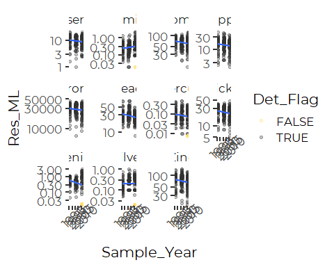
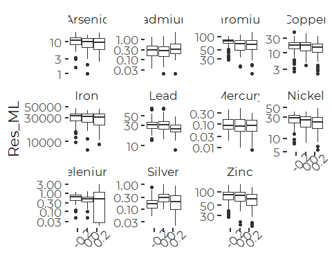
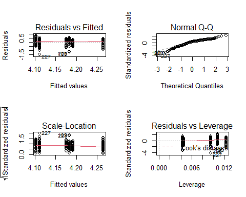
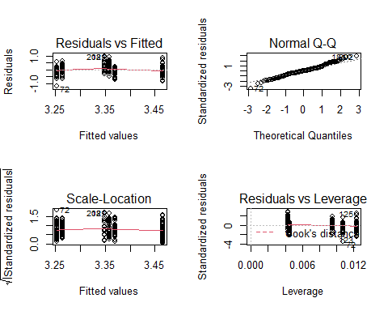
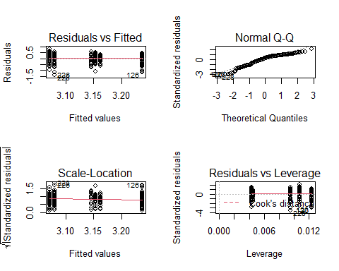
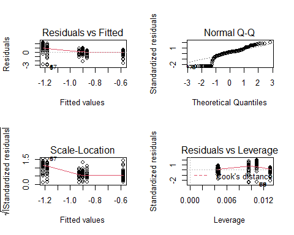
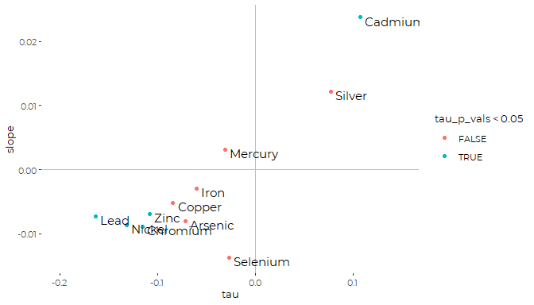
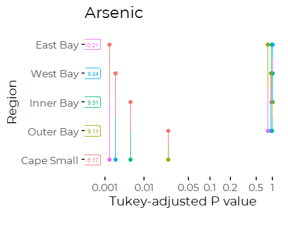

Trend Analysis for Metals
================
Curtis C. Bohlen, Casco Bay Estuary Partnership
October 17, 2020

  - [Introduction](#introduction)
  - [Load Libraries](#load-libraries)
  - [Load Data](#load-data)
      - [Folder References](#folder-references)
      - [Metals Data](#metals-data)
          - [Units](#units)
      - [Change Factor Levels](#change-factor-levels)
          - [Select which Metals to
            Analyze](#select-which-metals-to-analyze)
          - [Remove metals data on metals we will not
            analyze](#remove-metals-data-on-metals-we-will-not-analyze)
      - [Estimating Non-detects](#estimating-non-detects)
          - [Demonstrate That Worked](#demonstrate-that-worked)
  - [Utility function](#utility-function)
  - [Plot All Metals](#plot-all-metals)
  - [Linear Regression](#linear-regression)
      - [Identify Significant
        Regressions](#identify-significant-regressions)
      - [Significant Slopes](#significant-slopes)
      - [Model Diagnostic Plots](#model-diagnostic-plots)
  - [Robust Regression](#robust-regression)
      - [Identify “Significant” Regressions with Wilcoxon
        Test](#identify-significant-regressions-with-wilcoxon-test)
      - [T-S Slopes](#t-s-slopes)
      - [Significance Test with Kendall’s
        Tau](#significance-test-with-kendalls-tau)
      - [Values of Tau.](#values-of-tau.)
  - [ANOVA (Ordered Factor) Analysis](#anova-ordered-factor-analysis)
      - [Era Model](#era-model)
      - [Region Model](#region-model)
      - [Stepwise Model Selection](#stepwise-model-selection)
      - [Statistical Significance of Temporal
        Trend](#statistical-significance-of-temporal-trend)
          - [What’s up with Lead?](#whats-up-with-lead)
  - [Mixed Effects Models](#mixed-effects-models)
      - [Mixed Effects Linear
        Regression](#mixed-effects-linear-regression)
      - [Mixed Effects ANOVA](#mixed-effects-anova)
          - [Selected Model Terms](#selected-model-terms)
  - [Review of Temporal Trends](#review-of-temporal-trends)
      - [Regressions](#regressions)
      - [ANOVAs](#anovas)


# Introduction

Casco Bay Estuary Partnership collected sediment samples in 1991, 1994,
2000, 2001, 2002, 2010, and 2011 to look at concentrations of toxic
contaminants in Casco Bay surface Sediments. These studies were
complemented by data collected by under the auspices of EPA’s the
National Coastal Assessment (NCA) and National Coastal Condition
Assessment (NCCA).

Chemicals studied included metals. Here we analyze long-term trends in
metals. We use linear models only. Some caveats:

1.  We COULD use linear mixed models, controlling for repeat samples at
    similar locations. We do not do that here, largely so that we mimic
    the analysis from the Ramboll Report more closely.
2.  We do not examine alternative models that may address some
    shortcomings of linear models in this context, including robust
    (Theil-Sen) regressions, median-based linear models, or Generalized
    Linear Models based on more highly skewed data.
3.  We DO recalculate estimates based on maximum likelihood estimates of
    non-detects, although based here on the data distribution from the
    entire dataset. Non-detects are relatively rare, except for Selenium
    and Mercury.

# Load Libraries

``` r
library(tidyverse)
```

    ## -- Attaching packages --------------------------------------------------------------------------------------- tidyverse 1.3.0 --

    ## v ggplot2 3.3.2     v purrr   0.3.4
    ## v tibble  3.0.3     v dplyr   1.0.2
    ## v tidyr   1.1.2     v stringr 1.4.0
    ## v readr   1.3.1     v forcats 0.5.0

    ## -- Conflicts ------------------------------------------------------------------------------------------ tidyverse_conflicts() --
    ## x dplyr::filter() masks stats::filter()
    ## x dplyr::lag()    masks stats::lag()

``` r
library(readxl)
library(knitr)

library(mblm)
library(nlme)
```

    ## 
    ## Attaching package: 'nlme'

    ## The following object is masked from 'package:dplyr':
    ## 
    ##     collapse

``` r
#library(lme4)
library(emmeans)
library(MASS)
```

    ## 
    ## Attaching package: 'MASS'

    ## The following object is masked from 'package:dplyr':
    ## 
    ##     select

``` r
library(CBEPgraphics)
load_cbep_fonts()
theme_set(theme_cbep())

library(LCensMeans)
```

# Load Data

## Folder References

``` r
sibfldnm <- 'Derived_Data'
parent   <- dirname(getwd())
sibling  <- file.path(parent,sibfldnm)
niecefldnm <- 'Data_Subsets'
niece <- file.path(sibling,niecefldnm)
fn <- "metals.csv"
```

## Metals Data

``` r
metals_data <- read_csv(file.path(niece,fn),
                      col_types = cols(.default = col_character(),
                                        Sample_Year = col_double(),
                                        Replicate = col_integer(),
                                        CASRN = col_skip(),
                                        Result = col_double(),
                                        MDL = col_double(),
                                        RL = col_double(),
                                        Det_Flag = col_integer(),
                                        Qualifier = col_skip(),
                                        `QA Qualifier` = col_skip(),
                                        Reportable_Result = col_skip(),
                                        ERL = col_double(),
                                        ERM = col_double() )
                      ) %>%
  mutate(Replicate = Replicate == -1) %>%
  mutate(Det_Flag = Det_Flag == 1) %>%
  mutate(nd_flag = ! Det_Flag) %>%
  mutate(Parameter = if_else(Parameter == "Chromium (total)",
                             "Chromium",
                             Parameter))
```

### Units

See the “Review\_Data.Rmd” for details.

Ramboll Standardized units in the Access database, so, concentrations of
metals are expressed in \(\mu g/g\) dry weight (\~ ppm).

## Change Factor Levels

``` r
metals_data <- metals_data %>%
  mutate(LVL = factor(LVL, levels = c('Below ERL','Between ERL and ERM',
                                     'Above ERM'))) %>%
  mutate(Region = factor(Region, levels = c("Inner Bay",
                                            "West Bay",
                                            "East Bay",
                                            "Outer Bay",
                                            "Cape Small"))) %>%
  mutate(Era = ordered(Era, levels = c( "1990s", "2010s", "2000s")))
```

### Select which Metals to Analyze

``` r
(xt <- xtabs(~ Parameter + Era, data = metals_data))
```

    ##             Era
    ## Parameter    1990s 2010s 2000s
    ##   Aluminum       0    82    83
    ##   Antimony       0    82    83
    ##   Arsenic       65    82    83
    ##   Barium         0    75    38
    ##   Beryllium      0    75    38
    ##   Bismuth        0     0    38
    ##   Cadmium       65    82    83
    ##   Calcium        0     0    38
    ##   Chromium      65    82    83
    ##   Cobalt         0    75    38
    ##   Copper        65    82    83
    ##   Iron          65    82    83
    ##   Lead          65    82    83
    ##   Lithium        0     0    38
    ##   Magnesium      0     0    38
    ##   Manganese      0    82    83
    ##   Mercury       65    82    83
    ##   Molybdenum     0    75    38
    ##   Nickel        65    82    83
    ##   Potassium      0     0    38
    ##   Ruthenium      0     0    38
    ##   Selenium      65    82    83
    ##   Silver        65    82    83
    ##   Sodium         0     0    38
    ##   Strontium      0    75    38
    ##   Tellurium      0     0    38
    ##   Thallium       0    75    38
    ##   Tin            0    82    83
    ##   Titanium       0    75     0
    ##   Vanadium       0    75    38
    ##   Zinc          65    82    83

### Remove metals data on metals we will not analyze

We restrict analysis to those metals sampled in all three Eras.

``` r
rowcount <- apply(xt,1,function(x) sum(x>0))
selected <- names(rowcount[rowcount>2])

metals_data <- metals_data %>%
  filter(Parameter %in% selected)
rm(selected)
```

## Estimating Non-detects

Using our lognormal maximum likelihood procedure. WE apply this
procedure to the entire dataset for each metal at one time, which may
bias results if data should not be considered as being drawn from a
single distribution (e.g., if concentrations are dramatically different
in different Regions or Eras). Because detection limits are uniformally
low, often well below most observed values, this is likely to have
relatively small effect on slope estimates, which are our focus here.

Note that conditional means associated with rare non-detects often can
not be readily estimated using the existing algorithm, because it
requires drawing a huge sample to get enough samples below the detection
limits.

We up the parameter “max\_samp” to 5 million in hopes of reducing the
number of times that happens. That slows this computation so that it
takes several minutes, but even so, we get a few observations where we
can not estimate a conditional mean. (Note that each notification,
below, is for a single observation). This behavior may be addressed in a
future version of the LCMeans package.

This is a time-consuming step, so we set cache = true. That reduces time
for reknitting the notebook, but does not help when running the notebook
interactively. An alternative would be to save a version of the data
(with estimated conditional means) after this step, and not recalculate,
but that runs the risk of leaving in outdated data if upstream data is
modified.

``` r
metals_data <- metals_data %>%
  mutate(val = if_else(nd_flag, MDL, Result)) %>%
  group_by(Parameter) %>%
  mutate(Res_ML = sub_cmeans(val, nd_flag, max_samp = 5*10^6)) %>%
  ungroup(Parameter)
```

    ## Estimated sample size required >5e+06. Returning NA.
    ## 
    ## Estimated sample size required >5e+06. Returning NA.
    ## 
    ## Estimated sample size required >5e+06. Returning NA.
    ## 
    ## Estimated sample size required >5e+06. Returning NA.
    ## 
    ## Estimated sample size required >5e+06. Returning NA.

### Demonstrate That Worked

``` r
ggplot(metals_data, aes(val, Res_ML, color = nd_flag)) +
  geom_point() +
  facet_wrap('Parameter', scales = 'free') +
  theme_cbep(base_size = 10) +
  scale_y_log10() +
  scale_x_log10()
```

    ## Warning: Removed 18 rows containing missing values (geom_point).

<!-- -->

# Utility function

This is convenient for summarizing multiple models using lapply. Not
currently used, but handy during data exploration.

``` r
 mod_rev <- function(nm, m) {
 for (n in seq_along(m)) {
   cat("-------------------------------------\n")
   cat(nm[[n]], '\n')
   print(anova(m[[n]]))
   print(summary(m[[n]]))
   }
 }
```

# Plot All Metals

``` r
metals_data %>%
  ggplot(aes(Sample_Year, Res_ML)) +
  geom_jitter(aes(, color = Det_Flag), width = 0.1, alpha = 0.3) +
  geom_smooth(method = 'lm') +
  scale_color_manual(values = cbep_colors()[2:3]) +
  facet_wrap('Parameter', scales = 'free_y') +
  scale_y_log10() +
  theme(axis.text.x = element_text(angle = 45))
```

    ## `geom_smooth()` using formula 'y ~ x'

    ## Warning: Removed 18 rows containing non-finite values (stat_smooth).

    ## Warning: Removed 18 rows containing missing values (geom_point).

<!-- -->

``` r
metals_data %>%
  ggplot(aes( y = Res_ML, group = Era)) +
  geom_boxplot() +
  facet_wrap('Parameter', scales = 'free_y') +
  scale_y_log10() +
  theme(axis.text.x = element_text(angle = 45))
```

    ## Warning: Removed 18 rows containing non-finite values (stat_boxplot).

<!-- -->
Note the huge variation in all observations, and lack of readily
detected trends….

# Linear Regression

On log-transformed data.

``` r
mods <-metals_data %>%
  group_by(Parameter) %>%
  nest() %>%
  mutate(lr_mod = lapply(data,
                      function(df) lm(log(Res_ML) ~ Sample_Year, data = df)))
```

## Identify Significant Regressions

From the log-linear models. We use P \< 0.025 because of relatively poor
model diagnostics. We don’t want to trust “borderline” P values, and we
don’t want to go to the trouble (for this purpose) of using boorstraps
or other methods to assess confidence limits more rigorously.

``` r
lm_p_vals <- lapply(mods$lr_mod ,function(m) summary(m)$coefficients[2,4])
names(lm_p_vals) <- mods$Parameter
```

So, statistically significant regressions include the following

``` r
sig_lms <- names(lm_p_vals[lm_p_vals<0.025])
sig_lms
```

    ## [1] "Chromium" "Lead"     "Nickel"   "Selenium" "Zinc"

(Note that Cadmium and Silver show POSITIVE trends if you run this
analysis on the raw `Result`. That analysis is in error, as a
“non-detect” IS data, just not fully quantified data. In essence,
using `Result` drops all NDs from the analysis, which tends to bias
results by omitting values that we know are low, simply because we don’t
know HOW low they are.

## Significant Slopes

Lets look at the Parameters of significant regressions.

``` r
lm_slopes <- lapply(mods$lr_mod ,function(m) coefficients(m)[[2]])
names(lm_slopes) <- mods$Parameter
lm_slopes[lm_p_vals<0.025]
```

    ## $Chromium
    ## [1] -0.008083342
    ## 
    ## $Lead
    ## [1] -0.01061815
    ## 
    ## $Nickel
    ## [1] -0.008230204
    ## 
    ## $Selenium
    ## [1] -0.03177956
    ## 
    ## $Zinc
    ## [1] -0.008647957

All metals with significant trends are decreasing. Ramboll wrote about
Selenium, pointing to what they saw as a POSITIVE slope, but their
analysis omitted non-detects. But because of the strong non-normal
distribution of the selenium data because of the high number of
non-detects,we don’t believe this analysis either….

## Model Diagnostic Plots

``` r
oldpar <- par()
par(mfrow = c(2,2))
paste(as.character(mods$Parameter[lm_p_vals<0.05]), collapse = '   ...   ')
```

    ## [1] "Chromium   ...   Lead   ...   Nickel   ...   Selenium   ...   Zinc"

``` r
cat('\n')
```

``` r
lapply(mods$lr_mod[lm_p_vals<0.05],plot)
```

<!-- --><!-- --><!-- --><!-- --><!-- -->

    ## [[1]]
    ## NULL
    ## 
    ## [[2]]
    ## NULL
    ## 
    ## [[3]]
    ## NULL
    ## 
    ## [[4]]
    ## NULL
    ## 
    ## [[5]]
    ## NULL

``` r
par(oldpar)
```

    ## Warning in par(oldpar): graphical parameter "cin" cannot be set

    ## Warning in par(oldpar): graphical parameter "cra" cannot be set

    ## Warning in par(oldpar): graphical parameter "csi" cannot be set

    ## Warning in par(oldpar): graphical parameter "cxy" cannot be set

    ## Warning in par(oldpar): graphical parameter "din" cannot be set

    ## Warning in par(oldpar): graphical parameter "page" cannot be set

The model diagnostic plots are not great for most of these models, but
not dreadful, except for Selenium, where the large number of NDs is a
serious problem. The biggest problem is that the data (even after
transformation) is not normally distributed, generally with heavy tails.
We should not take reported p values too seriously.

# Robust Regression

We can conduct a robust regression, based on Theil-Sen slope estimators,
or (nearly equivalently) Kendall’s Tau.

We could not get the following to work inside a pipe or `lapply()` call,
so we fell back on using a loop. Also, mblm does not like having a log
transform in the model formula, so we had to move the log transform
outside the call.

``` r
lmods <- list()
for (n in seq_along(mods$lr_mod)) {
  metal <- mods$Parameter[n]
  tmp <- metals_data %>%
    filter(Parameter == metal) %>%
    mutate(logval = log(Res_ML)) %>%
    filter(! is.na(Res_ML))
  rlm <- mblm(logval ~ Sample_Year, data = tmp)
  lmods[[metal]] <- rlm
}

mods$rlm <- lmods
rm(lmods, rlm, tmp, metal)
```

The structure of the summaries and coefficients are similar to lm, so we
can use similar code to extract the details we want. Statistical
significance here is based on wilcox.test, which may not be entirely
appropriate. A better test based on Kendal’s Tau follows.

## Identify “Significant” Regressions with Wilcoxon Test

We choose not to rely on the significance test produced by the
`summary.mblm()` function. It is based on `wilcox.test()`, which is a
rank test procedure, thus ignoring magnitudes entirely, has been
criticized in the literature, and is even subtly put down in the
`summary.mblm` documentation.

In our setting, `wilcox.test()` identifies many more significant
patterns than do traditional linear models. However many of the
estimates slopes are quite low (data not shown).

A better conceptual match for testing the significance of the TS slope
estimates is Kendall’s Tau, which is appropriate in this setting, with
only a single predictor.

## T-S Slopes

``` r
rlm_slopes <- unlist(lapply(mods$rlm ,function(m) coefficients(m)[[2]]))
names(rlm_slopes) <- mods$Parameter
```

## Significance Test with Kendall’s Tau

We use p \< 0.05, since the a Theil-Sen analysis is less affected by
underlying distributions.

``` r
mods <- mods %>%
  mutate(tau_test = 
           lapply(data,
                  function(df) cor.test(~ log(Res_ML) + Sample_Year,
                                        data = df,
                                        method = 'kendall')))
```

## Values of Tau.

Tau functions (here) like a robust alternative to a correlations
coefficient. Negative values imply declining metals concentrations, just
as negative slopes would.

``` r
tau =   unlist(lapply(mods$tau_test, function(t) t$estimate))
names(tau) <- mods$Parameter
```

``` r
tau_p_vals = lapply(mods$tau_test, function(t) t$p.value)
names(tau_p_vals) <- mods$Parameter

(sig_tau <- names(tau_p_vals[tau_p_vals<0.05]))
```

    ## [1] "Cadmium"  "Chromium" "Lead"     "Nickel"   "Zinc"

``` r
tibble(tau = tau, slope = rlm_slopes) %>%

  ggplot(aes(tau, slope)) + geom_point(aes(color = tau_p_vals < 0.05)) +
  geom_hline(yintercept = 0, color = 'gray') +
  geom_vline(xintercept = 0, color = 'gray') +
  geom_text(aes(label = mods$Parameter)) +
  scale_x_continuous(expand = c(0.2, 0)) +
  theme_cbep(base_size = 10)
```

<!-- -->

So, we now end up with Cadmium increasing, Chromium, Lead, and Nickel
and Zinc declining. Mercury is the only metal that shows different
direction of change under the two tests, and Selenium has small tau, but
large slope. None of the metals with significant changes are
inconsistent.

Selenium shows no trend, although it showed a decline under linear
regression. This analysis is preferable, since Selenium had many missing
values. But even here, because of ties or near ties I would not take p
values too seriously.

Similarities between results under linear regression and robust
regression give some confidence that model results are not strongly
influenced by model choice.

Still, a more careful analysis might:  
1\. Test alternate GLMs that handle heavily skewed data, or  
2\. Use permutation tests to generate confidence intervals and “p
values”

Since our main purpose is development of graphics and table, these steps
are not strictly necessary here.

# ANOVA (Ordered Factor) Analysis

## Era Model

We can implement a similar model, fitting Eras instead of Sample\_Years,
by fitting an ordered factor. The default coding for an ordered factor
splits the fit into linear and quadratic terms, which here is
appropriate. One should be aware, however, that the coding with only
three levels of an ordered factor contrasts the first and third levels,
effectively ignoring the intermediate one. Whether you consider that a
feature or a bug, will depend on your perspective. Under a similar
linear model, deviations from linear trend become part of the error
term. Here, it is fit as part of the quadratic term.

Our focus is on saying whether there are long term trends, so we are
principally interested in the linear term.

``` r
mods <- mods %>%
  mutate(era_anova = lapply(data,
                      function(df) lm(log(Res_ML) ~ Era, data = df)))
```

Again, because of the non-normal distribution of error, we rely on p \<
0.025 as “poor man’s check” on potential problems with estimating p
values.

``` r
era_p_vals <- lapply(mods$era_anova ,function(m) summary(m)$coefficients[2,4])
names(era_p_vals) <- mods$Parameter

sig_era <- names(era_p_vals[era_p_vals<0.025])

era_slopes <- lapply(mods$era_anova ,function(m) coefficients(m)[[2]])
names(era_slopes) <- mods$Parameter
era_slopes[sig_era]
```

    ## $Chromium
    ## [1] -0.102532
    ## 
    ## $Silver
    ## [1] 0.3536355

## Region Model

``` r
mods <- mods %>%
  mutate(region_anova = lapply(data,
                      function(df) lm(log(Res_ML) ~ Region, data = df)))
```

For now, we don’t extract any results here….

## Stepwise Model Selection

We use stepwise model selection by AIC, using the `step()` function.

We could not get the following to work inside a pipe or `lapply()` call,
so we fell back on using a loop.

``` r
lmods <- list()
for (n in seq_along(mods$region_anova)) {
  metal <- mods$Parameter[n]
  tmp <- metals_data %>%
    filter(Parameter == metal)
  mod <- lm(log(Res_ML) ~ Era * Region, data = tmp)
  mod2 <- step(mod, trace = FALSE, direction = 'both')
  lmods[[metal]] <- mod2
}
mods$step_anova <- lmods
rm(lmods, tmp, mod, mod2)
```

Here are the final, selected models. Era (both linear and quadratic
terms ) are selected in most of hte models.

``` r
lapply(mods$step_anova, function(x) x$call)
```

    ## $Arsenic
    ## lm(formula = log(Res_ML) ~ Region, data = tmp)
    ## 
    ## $Cadmium
    ## lm(formula = log(Res_ML) ~ Era + Region, data = tmp)
    ## 
    ## $Chromium
    ## lm(formula = log(Res_ML) ~ Era + Region, data = tmp)
    ## 
    ## $Copper
    ## lm(formula = log(Res_ML) ~ Era + Region, data = tmp)
    ## 
    ## $Iron
    ## lm(formula = log(Res_ML) ~ Region, data = tmp)
    ## 
    ## $Lead
    ## lm(formula = log(Res_ML) ~ Era * Region, data = tmp)
    ## 
    ## $Nickel
    ## lm(formula = log(Res_ML) ~ Era + Region, data = tmp)
    ## 
    ## $Selenium
    ## lm(formula = log(Res_ML) ~ Era, data = tmp)
    ## 
    ## $Zinc
    ## lm(formula = log(Res_ML) ~ Era + Region, data = tmp)
    ## 
    ## $Mercury
    ## lm(formula = log(Res_ML) ~ Era + Region, data = tmp)
    ## 
    ## $Silver
    ## lm(formula = log(Res_ML) ~ Era * Region, data = tmp)

## Statistical Significance of Temporal Trend

This only tests the significance of the linear main effect, not
interactions or the quadratic term for Era. The only model fit with an
important interaction was for lead, so we handle that as a special case
in a moment.

``` r
step_p_vals <- lapply(mods$step_anova ,function(m) summary(m)$coefficients[2,4])
names(step_p_vals) <- mods$Parameter

sig_step <- names(step_p_vals[step_p_vals<0.025])
sig_step <- sig_step[! sig_step %in% c('Arsenic', 'Iron', 'Selenium')]
sig_step
```

    ## [1] "Chromium"

### What’s up with Lead?

Note that Lead is the only that selects a model with a significant
interaction.

``` r
pb_dat <- metals_data %>%
  filter(Parameter == 'Lead')
pb_mod <- lm(formula = log(Res_ML) ~ Era * Region, data = pb_dat)
summary(pb_mod)
```

    ## 
    ## Call:
    ## lm(formula = log(Res_ML) ~ Era * Region, data = pb_dat)
    ## 
    ## Residuals:
    ##      Min       1Q   Median       3Q      Max 
    ## -0.97870 -0.13228  0.01734  0.15539  0.55676 
    ## 
    ## Coefficients:
    ##                        Estimate Std. Error t value Pr(>|t|)    
    ## (Intercept)             3.71218    0.03023 122.780  < 2e-16 ***
    ## Era.L                   0.07439    0.05352   1.390   0.1659    
    ## Era.Q                   0.26727    0.05119   5.221  4.2e-07 ***
    ## RegionWest Bay         -0.46418    0.04335 -10.708  < 2e-16 ***
    ## RegionEast Bay         -0.43848    0.04704  -9.322  < 2e-16 ***
    ## RegionOuter Bay        -0.41788    0.04611  -9.062  < 2e-16 ***
    ## RegionCape Small       -0.77369    0.05974 -12.951  < 2e-16 ***
    ## Era.L:RegionWest Bay   -0.04367    0.07637  -0.572   0.5681    
    ## Era.Q:RegionWest Bay   -0.13804    0.07378  -1.871   0.0627 .  
    ## Era.L:RegionEast Bay   -0.02112    0.08359  -0.253   0.8007    
    ## Era.Q:RegionEast Bay   -0.11922    0.07929  -1.504   0.1341    
    ## Era.L:RegionOuter Bay  -0.15850    0.08241  -1.923   0.0558 .  
    ## Era.Q:RegionOuter Bay   0.03738    0.07724   0.484   0.6290    
    ## Era.L:RegionCape Small -0.13671    0.10113  -1.352   0.1779    
    ## Era.Q:RegionCape Small -0.30774    0.10576  -2.910   0.0040 ** 
    ## ---
    ## Signif. codes:  0 '***' 0.001 '**' 0.01 '*' 0.05 '.' 0.1 ' ' 1
    ## 
    ## Residual standard error: 0.2345 on 215 degrees of freedom
    ## Multiple R-squared:  0.5904, Adjusted R-squared:  0.5637 
    ## F-statistic: 22.14 on 14 and 215 DF,  p-value: < 2.2e-16

``` r
emmip(pb_mod, Region ~ Era, type = 'Response')
```

<!-- -->

``` r
rm(pb_dat, pb_mod)
```

So, what we see is as DROP followed by a RISE, except in Cape Small.
This is a complex message to convey, and provides only wobbly evidence
for any long-term increase or decline (since the linear terms are not
significant). In terms of reporting for SotB, this is no long-term
trend.

# Mixed Effects Models

A mixed effects model abstracts long-term unexplained differences among
sample locations (Substations) as sources of variation. We are not
INTERESTED in that variability, but we know it exists. This model
reduces the unexplained variation in the model, improving sensitivity to
other patterns.

## Mixed Effects Linear Regression

For our purposes, a linear regression makes better sense, so lets look
at

``` r
lmods <- list()
for (n in seq_along(mods$region_anova)) {
  metal <- mods$Parameter[n]
  tmp <- metals_data %>%
    filter(Parameter == metal) %>%
    filter(! is.na(Res_ML))
  mod <- lme(fixed = log(Res_ML) ~ Sample_Year + Region,
             random = ~ 1 | Substation,
             data = tmp,
             method = 'REML',
             na.action = na.omit)
  lmods[[metal]] <- mod
}
mods$me_lr_mod <- lmods
rm(lmods, tmp, mod)
```

``` r
me_lr_p_vals <- lapply(mods$me_lr_mod,
               function(m) summary(m)$tTable[2,5])
names(me_lr_p_vals) <- mods$Parameter

me_lr_slopes <- lapply(mods$me_lr_mod,
               function(m) summary(m)$tTable[2,1])
names(me_lr_slopes) <- mods$Parameter
sig_me_lr <- names(me_lr_slopes[me_lr_p_vals<0.025])
me_lr_slopes[sig_me_lr]
```

    ## $Arsenic
    ## [1] -0.006958773
    ## 
    ## $Cadmium
    ## [1] 0.009748836
    ## 
    ## $Chromium
    ## [1] -0.006536973
    ## 
    ## $Copper
    ## [1] -0.009199084
    ## 
    ## $Lead
    ## [1] -0.01021979
    ## 
    ## $Nickel
    ## [1] -0.007049378
    ## 
    ## $Selenium
    ## [1] -0.02878008
    ## 
    ## $Zinc
    ## [1] -0.007869143

By that test, all significant changes are decreasing.

## Mixed Effects ANOVA

We implement a step-wise model selection strategy here as well. We use
`method = 'ML'` to ensure appropriate comparison of models by AIC with
`stepAIC()`.

``` r
lmods <- list()
for (n in seq_along(mods$region_anova)) {
  metal <- mods$Parameter[n]
  tmp <- metals_data %>%
    filter(Parameter == metal) %>%
    filter(! is.na(Res_ML))
  mod <- lme(fixed = log(Res_ML) ~ Era * Region,
             random = ~ 1 | Substation,
             data = tmp,
             method = 'ML',
             na.action = na.omit)
  mod2 <- stepAIC(mod, trace = FALSE, direction = 'both')
  lmods[[metal]] <- mod2
}
mods$me_mod <- lmods
rm(lmods, tmp, mod, mod2)
```

### Selected Model Terms

(This is an alternative to extracting the call object that facilitates
searching for specific terms in the models via code.)

``` r
lapply(mods$me_mod,
               function(m) attr(terms(m), 'term.labels'))
```

    ## $Arsenic
    ## [1] "Era"    "Region"
    ## 
    ## $Cadmium
    ## [1] "Era"        "Region"     "Era:Region"
    ## 
    ## $Chromium
    ## [1] "Era"    "Region"
    ## 
    ## $Copper
    ## [1] "Era"    "Region"
    ## 
    ## $Iron
    ## [1] "Era"    "Region"
    ## 
    ## $Lead
    ## [1] "Era"        "Region"     "Era:Region"
    ## 
    ## $Nickel
    ## [1] "Era"    "Region"
    ## 
    ## $Selenium
    ## [1] "Era"    "Region"
    ## 
    ## $Zinc
    ## [1] "Era"    "Region"
    ## 
    ## $Mercury
    ## [1] "Era"    "Region"
    ## 
    ## $Silver
    ## [1] "Era"        "Region"     "Era:Region"

So by this model, ALL metals show temporal patterns (or at least AIC
suggests temporal terms are useful for prediction). However, few models
show significant linear trends.

In an lme summary object, the coefficients table is called ‘tTable’, so
we can pull statistically significant linear temporal trends, as before

``` r
me_p_vals <- lapply(mods$me_mod,
               function(m) summary(m)$tTable[2,5])
names(me_p_vals) <- mods$Parameter
sig_me <- names(me_p_vals[me_p_vals<0.025])
sig_me
```

    ## [1] "Chromium" "Silver"

SO only TWO metals suggest simple (linear) trends. These are the same
two identified by the ANOVA, above. Slopes estimated here are somewhat
lower than in the simple ANOVA. Chromium is declining and silver
increasing, as before.

``` r
me_slopes <- lapply(mods$me_mod,
               function(m) summary(m)$tTable[2,1])
names(me_slopes) <- mods$Parameter
me_slopes[me_p_vals<0.025]
```

    ## $Chromium
    ## [1] -0.08391268
    ## 
    ## $Silver
    ## [1] 0.2481796

However, for cadmium, lead and silver, that test leaves out any detail
about trends buried in the interaction terms. We do not bother to review
those in detail here, since we will not use these results directly in
SoCB.

# Review of Temporal Trends

## Regressions

  - Regression,
  - Kendall’s Tau (standing in for the Robust Regression)
  - Mixed Effect Regression (questionable p values)

<!-- end list -->

``` r
sig_lms
```

    ## [1] "Chromium" "Lead"     "Nickel"   "Selenium" "Zinc"

``` r
sig_tau
```

    ## [1] "Cadmium"  "Chromium" "Lead"     "Nickel"   "Zinc"

``` r
sig_me_lr
```

    ## [1] "Arsenic"  "Cadmium"  "Chromium" "Copper"   "Lead"     "Nickel"   "Selenium"
    ## [8] "Zinc"

So, “Chromium” “Lead” “Nickel” “Zinc” show in ALL tests.

## ANOVAs

Looking at linear main effects trems only. If we were going down this
path, we’d need to look at quatratic ters and interactions too.

``` r
sig_era
```

    ## [1] "Chromium" "Silver"

``` r
sig_step
```

    ## [1] "Chromium"

``` r
sig_me
```

    ## [1] "Chromium" "Silver"
